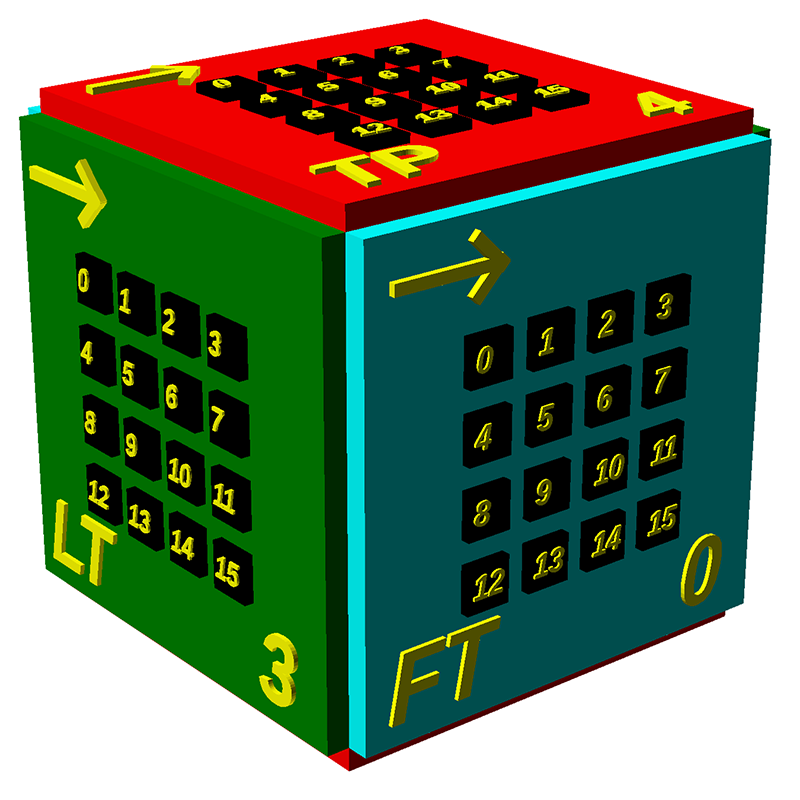
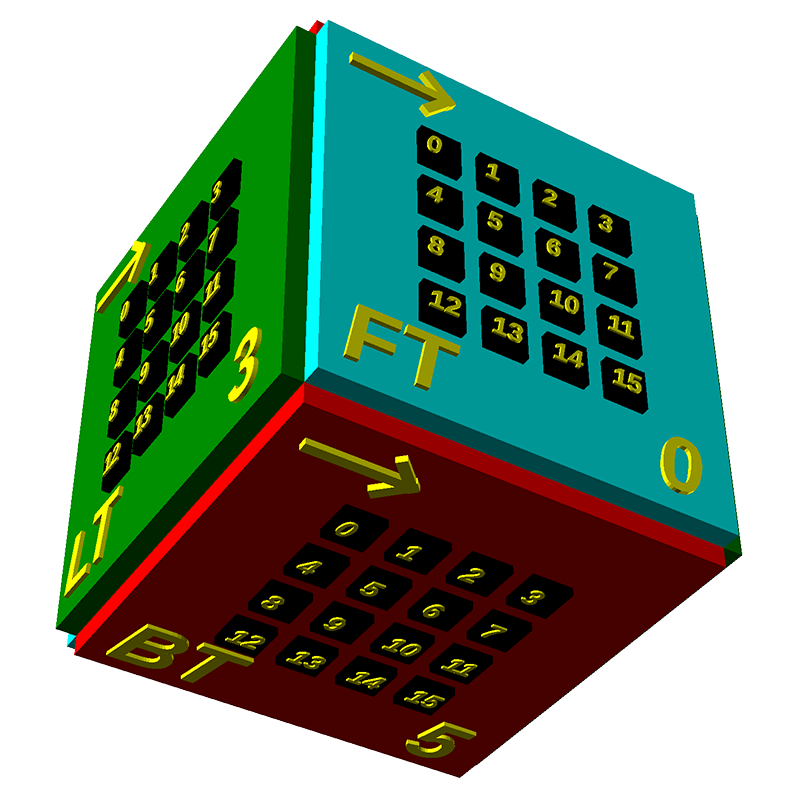

# Mini interactive cube

The initial cube was made using led panels on each sides, but it lacks one important piece, input, and only having orientation/acceleration is not optimal, this cube addresses that, and is slightly different, it has sixteen buttons on each of the six sides and they are all usable through OSC.

## Enclosure

### Cube sides and pixel ordering

Looking at the cube from the natural angle, from top (side #4) left (side #3) front (side #0):

Looking at the cube from the back (side #2) right (side #1):

Looking at the cube from the bottom (side #5) left (side #3):

### Laser template

## OSC Messages

The device sends and receives OSC messages, these are the different ones.

All OSC messages share the prefix `/cubename/` which is a 8 character string that can be configured, by default it's `cubeNNNN` where `NNNN` is a part of the wlan mac address.

### Key press

`/cubeNNNN/btn btn down`

Namespace: `/cubeNNNN/btn`

Arguments:
  `btn` int32 - Which button
  `down` int32 - 1 = Button was pressed, 0 = Button was released

### Gyro data

`/cubeNNNN/rot rx ry rz`

Namespace: `/cubeNNNN/rot`

Arguments:
  `rx` int32 - Relative rotation around X.
  `ry` int32 - Relative rotation around Y.
  `rz` int32 - Relative rotation around Z.

### Accelerometer data

`/cubeNNNN/acc ax ay az`

Namespace: `/cubeNNNN/acc`

Arguments:
  `ax` int32 - Relative acceleration X.
  `ay` int32 - Relative acceleration Y.
  `az` int32 - Relative acceleration Z.

### Update a single pixel

`/cubeNNNN/leds led on`

Namespace: `/cubeNNNN/leds`

Arguments:
  `led` int32 - Pixel to change
  `on` int32 - 1 = Lit, 0 = Not lit 

### Update one side

`/cubeNNNN/leds side n0 n1`

Namespace: `/cubeNNNN/leds`

Arguments:
  `side` int32 - Which side to update. (0 - 5)
  `n0`, `n1` int32 - Two 8bit values, 16 bits, 16 leds.

### Update entire display

`/cubeNNNN/leds n0 n1 n2 n3 n4 n5 n6 n7 n8 n9 n10 n11`

Namespace: `/cubeNNNN/leds`

Arguments:
  `n0..n11` int32 - Led pixels, 12 8bit values - Two values for each side, 16 bits, 16 leds.

## Configuration

When the device boots up, it will blink the first pixel a couple of times, if you hold it down at that time, the firmware will go into configuration mode, from there it will set up a wireless network named `Cube Setup - NNNN`, connect to that network and open `http://192.168.0.1` to configure your device.

